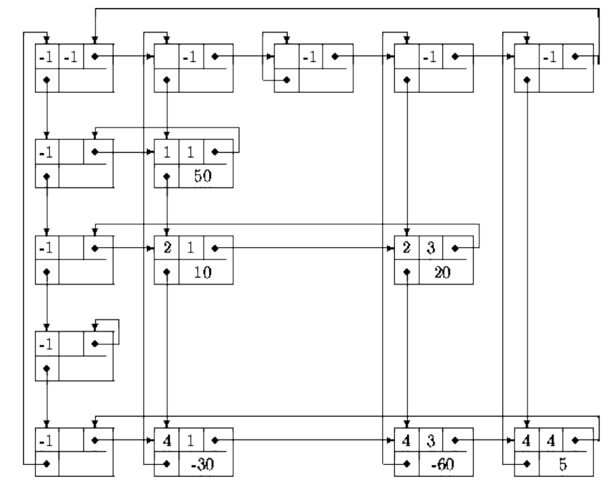

# Matriz esparsa

Este repositório contém o código em java para ler um arquivo pgm para uma matriz esparsa, e realizar alguns processamentos de imagem com a mesma. 

A matriz é modelada da seguinte forma:



### Compilação

Para compilar o sistema, abra um terminal na pasta do projeto e faça:

```bash
cd src
javac -Xlint:unchecked Sistema/**/*.java 
```

### Execução

O comando abaixo executará o programa (certifique-se de que o terminal está aberto na pasta `/src`):

```bash
java Sistema.Sistema 
```